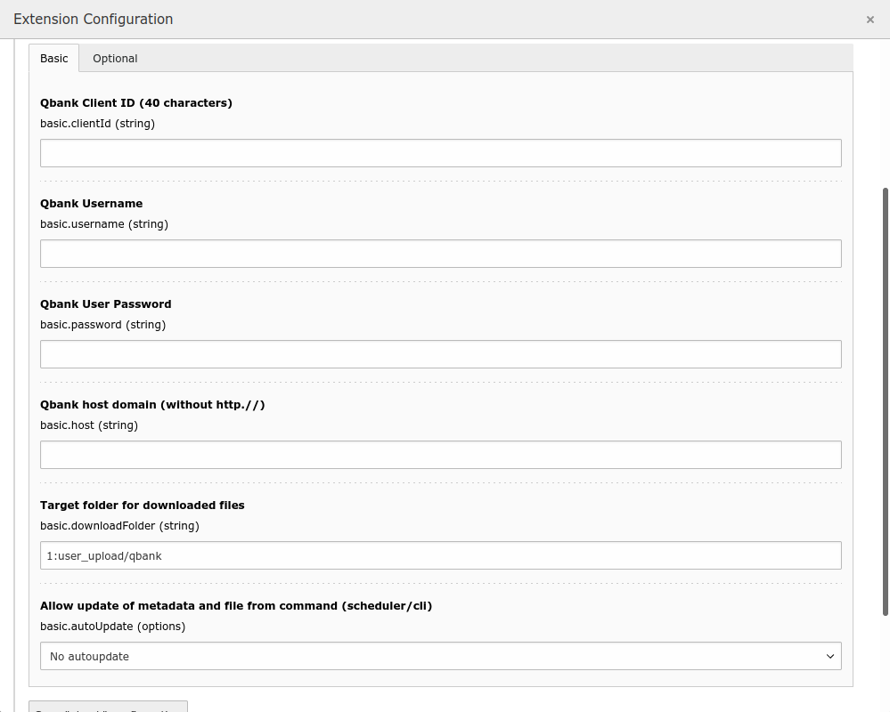

.. include:: ../Includes.txt

.. _configuration:

=============
Configuration
=============

In order for the extension to work, it must be configured.
In the TYPO3 Backend, navigate to *Admin Tools > Settings > Extension Configuration > qbank*
and set the required global configuration options in the "Basic" tab.
Configuration options in the "Optional" tab are not required,
but enable additional functionality, such as usage reporting.

Configuration options can also be set using environment variables.
These will override any setting made in the Extension Configuration module.

.. _global-configuration-options:

Available global configuration options
======================================

Basic
-----

.. container:: table-row

    Setting
        basic.clientId (string)
    Label
        QBank Client ID (40 characters)
    Environment variable
        APP_QBANK_CLIENTID

.. container:: table-row

    Setting
        basic.username (string)
    Label
        QBank Username
    Environment variable
        APP_QBANK_USERNAME

.. container:: table-row

    Setting
        basic.password (string)
    Label
        QBank User Password
    Environment variable
        APP_QBANK_PASSWORD

.. container:: table-row

    Setting
        basic.host (string)
    Label
        QBank host domain (without http.//)
    Description
        The QBank host domain without scheme (e.g. http.//), e.g. "mycompany.qbank.se".
    Environment variable
        APP_QBANK_HOST

.. container:: table-row

    Setting
        basic.downloadFolder (string)
    Label
        Target folder for downloaded files
    Description
        Where downloaded files are stored. [File Storage Id:path]
    Default
        1:user_upload/qbank
    Environment variable
        APP_QBANK_DOWNLOADFOLDER

.. container:: table-row

    Setting
        basic.autoUpdate (options)
    Label
        Allow update of metadata and file from command (scheduler/cli)
    Description
        Configure if metadata and file is allowed to be updated from command.
        0: No autoupdate, 1: Metadata, 2: File, 3: Metadata and file.
    Default
        No autoupdate
    Environment variable
        APP_QBANK_AUTOUPDATE

Optional
--------

.. container:: table-row

    Setting
        optional.sessionSource (int)
    Label
        Event session source ID
    Description
        Setting this will enable usage reporting.
        To get a session source issued, contact support@qbank.se.
    Environment variable
        APP_QBANK_SESSIONSOURCE

.. container:: table-row

    Setting
        optional.deploymentSites (string)
    Label
        Deployment sites
    Description
        Comma-separated list of deployment sites. Empty means show all.
    Environment variable
        APP_QBANK_DEPLOYMENTSITES

Site and language configuration
===============================

Deployment sites can also be configured on a per-site and per-site-language basis.

Site configuration
------------------

In the TYPO3 Backend, navigate to *Site Management > Sites > {Your site} > Qbank* tab.
You can set the field "Deployment sites" to a comma-separated list of deployment sites.
If empty, the value is inherited from the global extension configuration or environment variables.

Site language configuration
---------------------------

In the TYPO3 Backend, navigate to *Site Management > Sites > {Your site} > Languages* tab.
Select the language you would like to edit and find the "QBank deployment sites" option.
You can set the field to a comma-separated list of deployment sites.
If empty, the value is inherited from the site's "Deployment sites" field,
global extension configuration, or environment variables.

