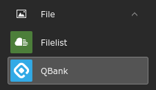
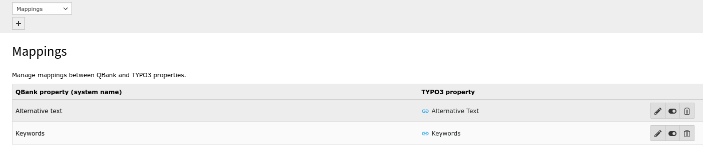
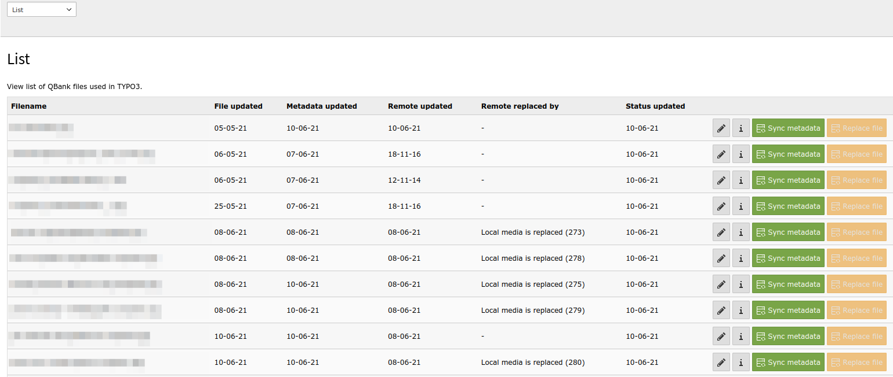

.. include:: ../Includes.txt

.. _module:

============
QBank Module
============

The extension adds a BE module named QBank.
There are three views in the module.

.. _overview:

Overview
========

This view will contain an overview (TBD).

.. _mappings:

Mappings
========

This view displays mappings between QBank and TYPO3 properties.
It is also possible to add new mappings from this view by
clicking the "Add new mapping" button (+) below the view selector
in top of the page.

.. _list:

List
====

Displays a list of downloaded QBank files.
Some parts are equal to the standard functionality in Filelist
like "Edit File Metadata" and "Show references".
It is also possible to manually syncronize metadata and replace file here.

